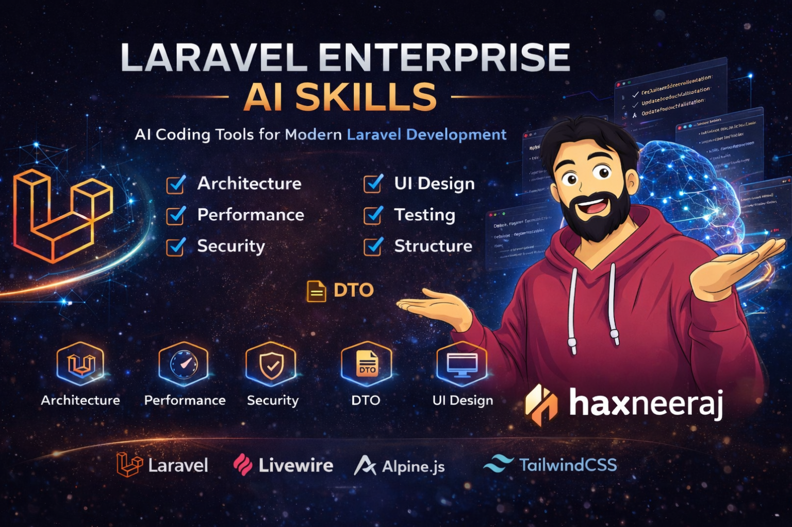

# Laravel Enterprise AI Skills



AI skill pack designed for modern Laravel development.

This repository provides a set of structured **AI coding skills** that enforce best practices when using AI coding tools.

Compatible with:

* GitHub Copilot
* Cursor
* Claude Code
* Antigravity
* Other AI coding assistants

---

# Supported Stack

Laravel
Livewire 4
Alpine.js
TailwindCSS
PHPUnit

---

# Purpose

These skills help AI generate production-quality Laravel code by enforcing:

* Clean architecture
* High performance queries
* Secure coding practices
* Scalable UI patterns
* Proper testing strategy
* Modular project structure

---

# Skill Modules

## 1 Laravel Architecture Skill

Enforces enterprise architecture.

```
Entry
 ↓
Validation
 ↓
DTO
 ↓
Action
 ↓
Service
 ↓
Driver Manager
 ↓
Driver
 ↓
Interface
 ↓
Model
```

Skill file:

```
skills/laravel-livewire4-architecture-skill.md
```

---

## 2 Laravel Performance Skill

Detects performance issues:

* N+1 queries
* missing eager loading
* inefficient pagination
* heavy Livewire rendering

Skill file:

```
skills/laravel-livewire4-performance-skill.md
```

---

## 3 Laravel Security Skill

Detects vulnerabilities:

* SQL injection
* XSS
* insecure file uploads
* missing validation
* mass assignment issues

Skill file:

```
skills/laravel-security-skill.md
```

---

## 4 Laravel Code Quality Skill

Maintains clean code.

Detects:

* large classes
* God services
* bad naming
* duplicate logic
* dependency injection issues

Skill file:

```
skills/laravel-code-quality-skill.md
```

---

## 5 Livewire UI Design Skill

Enforces modern frontend patterns.

Rules include:

* reusable components
* SVG icon components
* Tailwind design system
* Alpine interactivity
* Livewire component architecture

Skill file:

```
skills/laravel-livewire4-design-skill.md
```

---

## 6 Laravel Testing Skill

Encourages automated tests:

* PHPUnit unit tests
* feature tests
* Livewire tests
* action tests
* service tests

Skill file:

```
skills/laravel-livewire4-testing-skill.md
```

---

## 7 Laravel Project Structure Skill

Maintains modular project structure.

Ensures:

* domain based folders
* proper naming conventions
* clean module boundaries
* organized tests

Skill file:

```
skills/laravel-livewire4-project-structure-skill.md
```

---

# Example Skills Folder

```
skills
 ├ laravel-code-quality-skill.md
 ├ laravel-livewire4-architecture-skill.md
 ├ laravel-livewire4-design-skill.md
 ├ laravel-livewire4-performance-skill.md
 ├ laravel-livewire4-project-structure-skill.md
 ├ laravel-livewire4-testing-skill.md
 └ laravel-security-skill.md
```

---

# Example Usage

When used with AI coding tools, these skills help ensure generated code follows Laravel best practices.

Example architecture enforced:

```
Livewire Component
       ↓
Action
       ↓
Service
       ↓
Driver
       ↓
Model
```

---

# Ideal Use Cases

These skills are designed for:

* SaaS applications
* Fintech platforms
* MLM systems
* Enterprise Laravel applications
* Large Livewire projects

---

# Contributing

Contributions are welcome.

You may improve rules for:

* Laravel
* Livewire
* performance
* security
* architecture

Please open a Pull Request with improvements.

---

# License

MIT License

---

# Author

Created and maintained by:

**Neeraj Saini (HaxNeeraj)**

GitHub
https://github.com/haxneeraj/

LinkedIn
https://www.linkedin.com/in/hax-neeraj/

---

# Support

If you find this project helpful, consider:

⭐ Starring the repository
🔁 Sharing with other Laravel developers
